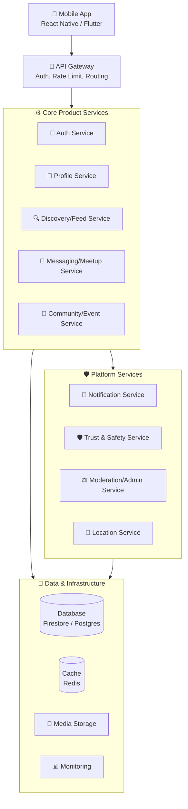

# High-Level Architecture

## Numbered Flow

1. **Client** makes request (HTTPS/WebSocket)
2. **API Gateway** validates session, checks rate limits, routes to service
3. **Core Product Services** handle business logic:
   - Auth: OTP, sessions, custom claims
   - Profile: CRUD, privacy, avatar
   - Discovery/Feed: feed generation, people search, recommendations
   - Messaging/Meetup: 1:1 chat, realtime, meetup invites
   - Community/Event: groups, posts, events, membership
4. **Platform Services** provide cross-cutting concerns:
   - Notifications: templates, preferences, multi-channel dispatch
   - Trust & Safety: reports, blocks, pattern detection, appeals
   - Moderation/Admin: user mgmt, content review, audit logs
   - Location: geohash, proximity, place suggestions
5. **Data & Infrastructure** persist and serve data:
   - Database: primary storage (users, profiles, posts, messages, etc.)
   - Cache: sessions, rate limits, presence, feed cache
   - Media Storage: avatars, post/chat/event media, evidence
   - Monitoring: metrics, logs, traces, alerts

## Deployment

- Single Firebase/Supabase project
- Services deployed as Cloud Functions (Firebase) or Edge Functions (Supabase)
- Shared database, shared auth, shared secrets
- Split into separate services only when scaling demands it