# Database ER Diagram

```mermaid
erDiagram
    %% Core User Entities
    USER ||--|| PROFILE : has
    USER ||--o{ AUTH_METHOD : uses
    USER ||--o{ SESSION : has
    USER ||--o{ DEVICE : owns
    USER ||--o{ VERIFICATION : attempts
    USER ||--o{ USER_SETTINGS : configures
    USER ||--o{ BLOCK : initiates
    USER ||--o{ BLOCK : receives
    USER ||--o{ REPORT : submits
    USER ||--o{ REPORT : reported_in

    %% Profile Details
    PROFILE ||--o{ PROFILE_INTEREST : has
    PROFILE ||--o{ PROFILE_LANGUAGE : speaks
    PROFILE ||--o{ SOCIAL_LINK : includes
    PROFILE }|--|| COUNTRY : from
    PROFILE }|--|| COLLEGE : attends
    PROFILE }|--|| COURSE : studies
    PROFILE }o--o| AREA : located_in

    %% Reference Data
    COUNTRY ||--o{ COLLEGE : has
    COLLEGE ||--o{ COURSE : offers
    INTEREST ||--o{ PROFILE_INTEREST : tagged_in
    LANGUAGE ||--o{ PROFILE_LANGUAGE : spoken_in
    AREA ||--o{ COLLEGE : contains

    %% Social/Feed
    USER ||--o{ POST : creates
    POST ||--o{ POST_MEDIA : contains
    POST ||--o{ LIKE : receives
    POST ||--o{ COMMENT : receives
    POST ||--o{ POST_REPORT : reported_in
    COMMENT ||--o{ LIKE : receives
    COMMENT ||--o{ COMMENT_REPORT : reported_in
    USER ||--o{ LIKE : gives
    USER ||--o{ COMMENT : writes
    POST }|--|| COLLEGE : visible_to
    POST }|--|| COUNTRY : visible_to

    %% Messaging
    USER ||--o{ CONVERSATION_PARTICIPANT : participates
    CONVERSATION ||--o{ CONVERSATION_PARTICIPANT : has
    CONVERSATION ||--o{ MESSAGE : contains
    MESSAGE ||--o{ MESSAGE_MEDIA : contains
    MESSAGE ||--o{ MESSAGE_REPORT : reported_in
    USER ||--o{ MESSAGE : sends
    CONVERSATION }|--|| MEETUP_INVITATION : linked_to

    %% Meetup
    USER ||--o{ MEETUP_INVITATION : sends
    USER ||--o{ MEETUP_INVITATION : receives
    MEETUP_INVITATION ||--o{ MEETUP_RESPONSE : has
    MEETUP_INVITATION }|--|| LOCATION_SUGGESTION : suggests
    MEETUP_INVITATION }|--|| MEETUP_TYPE : categorized_as

    %% Communities
    USER ||--o{ COMMUNITY_MEMBERSHIP : joins
    COMMUNITY ||--o{ COMMUNITY_MEMBERSHIP : has
    COMMUNITY ||--o{ COMMUNITY_POST : contains
    COMMUNITY ||--o{ COMMUNITY_EVENT : hosts
    COMMUNITY_POST ||--o{ LIKE : receives
    COMMUNITY_POST ||--o{ COMMENT : receives
    USER ||--o{ COMMUNITY_POST : creates
    COMMUNITY }|--|| COMMUNITY_TYPE : categorized_as
    COMMUNITY }|--|| COLLEGE : associated_with
    COMMUNITY }|--|| COUNTRY : associated_with

    %% Events
    USER ||--o{ EVENT_ATTENDANCE : attends
    EVENT ||--o{ EVENT_ATTENDANCE : has
    EVENT }|--|| COMMUNITY : organized_by
    EVENT }|--|| EVENT_TYPE : categorized_as
    EVENT }|--|| LOCATION : at
    EVENT }|--o| USER : created_by

    %% Notifications
    USER ||--o{ NOTIFICATION : receives
    NOTIFICATION }|--|| NOTIFICATION_TYPE : typed_as
    NOTIFICATION }|--o| POST : related_to
    NOTIFICATION }|--o| MESSAGE : related_to
    NOTIFICATION }|--o| MEETUP_INVITATION : related_to
    NOTIFICATION }|--o| EVENT : related_to
    NOTIFICATION }|--o| COMMUNITY : related_to

    %% Trust & Safety
    REPORT }|--|| REPORT_TYPE : categorized_as
    REPORT }|--|| REPORT_STATUS : status
    USER ||--o{ MODERATION_ACTION : receives
    MODERATION_ACTION }|--|| ACTION_TYPE : typed_as
    MODERATION_ACTION }|--o| REPORT : from

    %% Location/Proximity
    USER ||--o{ USER_LOCATION : has
    USER_LOCATION }|--|| AREA : in
    USER_LOCATION }|--o| GEOHASH : indexed_by

    %% Entity Attributes
    USER {
        uuid id PK
        string email UK
        string phone UK
        enum auth_method "email|phone"
        boolean is_verified
        boolean is_active
        boolean is_banned
        timestamp created_at
        timestamp updated_at
        timestamp last_active_at
        uuid referred_by FK
    }

    PROFILE {
        uuid user_id PK,FK
        string full_name
        string avatar_url
        string bio
        uuid country_id FK
        uuid college_id FK
        uuid course_id FK
        enum arrival_status "just_arrived|settling_in|settled"
        jsonb privacy_settings
        timestamp created_at
        timestamp updated_at
    }

    AUTH_METHOD {
        uuid id PK
        uuid user_id FK
        enum type "email|phone"
        string value
        boolean is_primary
        boolean is_verified
        timestamp verified_at
    }

    SESSION {
        uuid id PK
        uuid user_id FK
        string refresh_token_hash
        string device_fingerprint
        timestamp expires_at
        timestamp created_at
        boolean revoked
    }

    DEVICE {
        uuid id PK
        uuid user_id FK
        string device_token
        string platform "ios|android|web"
        string app_version
        timestamp last_seen
    }

    VERIFICATION {
        uuid id PK
        uuid user_id FK
        enum type "email|phone|identity"
        enum status "pending|verified|rejected"
        string code_hash
        timestamp expires_at
        timestamp created_at
    }

    USER_SETTINGS {
        uuid user_id PK,FK
        boolean push_enabled
        boolean email_enabled
        boolean location_sharing
        boolean show_online_status
        boolean read_receipts
        jsonb notification_preferences
        jsonb discovery_preferences
    }

    COUNTRY {
        uuid id PK
        string code UK "ISO 3166-1 alpha-2"
        string name
        string emoji
        boolean is_active
    }

    COLLEGE {
        uuid id PK
        string name
        string domain UK "for email verification"
        uuid country_id FK
        uuid area_id FK
        boolean is_verified
    }

    COURSE {
        uuid id PK
        string name
        uuid college_id FK
        string level "undergrad|postgrad|phd"
    }

    INTEREST {
        uuid id PK
        string name UK
        string category
        string icon
    }

    PROFILE_INTEREST {
        uuid profile_id FK
        uuid interest_id FK
        timestamp added_at
    }

    LANGUAGE {
        uuid id PK
        string code UK "ISO 639-1"
        string name
    }

    PROFILE_LANGUAGE {
        uuid profile_id FK
        uuid language_id FK
        enum proficiency "native|fluent|intermediate|basic"
    }

    SOCIAL_LINK {
        uuid id PK
        uuid profile_id FK
        enum platform "instagram|linkedin|twitter|github|other"
        string url
    }

    AREA {
        uuid id PK
        string name
        string city
        string state
        uuid country_id FK
        geometry bounds
        string geohash_prefix
    }

    POST {
        uuid id PK
        uuid author_id FK
        text content
        enum visibility "college|country|public"
        uuid college_id FK
        uuid country_id FK
        timestamp created_at
        timestamp updated_at
        boolean is_deleted
    }

    POST_MEDIA {
        uuid id PK
        uuid post_id FK
        string url
        enum type "image|video"
        int sort_order
        int width
        int height
    }

    LIKE {
        uuid id PK
        uuid user_id FK
        uuid post_id FK
        uuid comment_id FK
        uuid community_post_id FK
        timestamp created_at
    }

    COMMENT {
        uuid id PK
        uuid post_id FK
        uuid author_id FK
        text content
        uuid parent_comment_id FK
        timestamp created_at
        boolean is_deleted
    }

    POST_REPORT {
        uuid id PK
        uuid post_id FK
        uuid reporter_id FK
        uuid report_type_id FK
        text description
        timestamp created_at
    }

    COMMENT_REPORT {
        uuid id PK
        uuid comment_id FK
        uuid reporter_id FK
        uuid report_type_id FK
    }

    CONVERSATION {
        uuid id PK
        enum type "direct|group"
        uuid created_by FK
        timestamp created_at
        timestamp updated_at
    }

    CONVERSATION_PARTICIPANT {
        uuid conversation_id FK
        uuid user_id FK
        enum role "member|admin"
        timestamp joined_at
        timestamp last_read_at
        boolean is_muted
        boolean is_archived
    }

    MESSAGE {
        uuid id PK
        uuid conversation_id FK
        uuid sender_id FK
        text content
        enum type "text|image|location|meetup_invite|system"
        uuid reply_to_id FK
        timestamp sent_at
        timestamp delivered_at
        timestamp read_at
        boolean is_deleted
        boolean is_edited
    }

    MESSAGE_MEDIA {
        uuid id PK
        uuid message_id FK
        string url
        enum type "image|video|file"
        string mime_type
        int file_size
    }

    MESSAGE_REPORT {
        uuid id PK
        uuid message_id FK
        uuid reporter_id FK
        uuid report_type_id FK
    }

    MEETUP_INVITATION {
        uuid id PK
        uuid conversation_id FK
        uuid sender_id FK
        uuid recipient_id FK
        uuid meetup_type_id FK
        uuid location_suggestion_id FK
        timestamp proposed_time
        text note
        enum status "pending|accepted|declined|expired|cancelled"
        timestamp responded_at
        timestamp created_at
    }

    MEETUP_TYPE {
        uuid id PK
        string name "coffee|campus_walk|study_session|custom"
        string icon
        int default_duration_min
    }

    LOCATION_SUGGESTION {
        uuid id PK
        string name
        string address
        double lat
        double lng
        string place_type "cafe|library|campus|park|custom"
        boolean is_public
    }

    MEETUP_RESPONSE {
        uuid id PK
        uuid invitation_id FK
        uuid responder_id FK
        enum response "accept|decline|reschedule"
        timestamp proposed_time
        text note
        timestamp created_at
    }

    COMMUNITY {
        uuid id PK
        string name
        string description
        uuid community_type_id FK
        uuid college_id FK
        uuid country_id FK
        uuid creator_id FK
        enum visibility "public|private|invite_only"
        int member_count
        timestamp created_at
        boolean is_active
    }

    COMMUNITY_TYPE {
        uuid id PK
        string name "country|campus|course|interest|arrival_cohort"
        string icon
    }

    COMMUNITY_MEMBERSHIP {
        uuid community_id FK
        uuid user_id FK
        enum role "member|moderator|admin"
        timestamp joined_at
        boolean notifications_enabled
    }

    COMMUNITY_POST {
        uuid id PK
        uuid community_id FK
        uuid author_id FK
        text content
        timestamp created_at
        boolean is_pinned
        boolean is_deleted
    }

    COMMUNITY_EVENT {
        uuid id PK
        uuid community_id FK
        uuid event_id FK
    }

    EVENT {
        uuid id PK
        string title
        text description
        uuid event_type_id FK
        uuid location_id FK
        uuid organizer_id FK
        timestamp start_time
        timestamp end_time
        int capacity
        enum status "draft|published|cancelled|completed"
        timestamp created_at
    }

    EVENT_TYPE {
        uuid id PK
        string name "welcome|cultural|sports|study|coffee|custom"
        string icon
    }

    LOCATION {
        uuid id PK
        string name
        string address
        double lat
        double lng
        string place_id
    }

    EVENT_ATTENDANCE {
        uuid event_id FK
        uuid user_id FK
        enum status "going|interested|declined"
        timestamp responded_at
    }

    NOTIFICATION {
        uuid id PK
        uuid user_id FK
        uuid notification_type_id FK
        string title
        string body
        jsonb data
        boolean is_read
        timestamp created_at
        timestamp read_at
    }

    NOTIFICATION_TYPE {
        uuid id PK
        string key "new_message|meetup_invite|meetup_response|like|comment|new_countryman|event_reminder"
        string template
        enum priority "high|normal|low"
    }

    REPORT {
        uuid id PK
        uuid reporter_id FK
        uuid reported_user_id FK
        uuid report_type_id FK
        uuid report_status_id FK
        text description
        jsonb evidence
        timestamp created_at
        timestamp resolved_at
        uuid resolved_by FK
    }

    REPORT_TYPE {
        uuid id PK
        string name "harassment|spam|scam|inappropriate|fake_profile|safety_threat|other"
        enum severity "low|medium|high|critical"
    }

    REPORT_STATUS {
        uuid id PK
        string name "pending|reviewing|actioned|dismissed|appealed"
    }

    MODERATION_ACTION {
        uuid id PK
        uuid user_id FK
        uuid action_type_id FK
        uuid report_id FK
        uuid moderator_id FK
        text reason
        timestamp expires_at
        timestamp created_at
    }

    ACTION_TYPE {
        uuid id PK
        string name "warn|temp_suspend|perm_ban|remove_content|shadow_restrict|require_verification"
        boolean is_reversible
    }

    USER_LOCATION {
        uuid id PK
        uuid user_id FK
        uuid area_id FK
        string geohash
        double lat_approx
        double lng_approx
        timestamp updated_at
    }

    GEOHASH {
        string hash PK
        uuid area_id FK
        int precision
    }

    BLOCK {
        uuid blocker_id FK
        uuid blocked_id FK
        timestamp created_at
        string reason
    }
```

## Numbered Entity Groups

1. **Core User** — `USER`, `PROFILE`, `AUTH_METHOD`, `SESSION`, `DEVICE`, `VERIFICATION`, `USER_SETTINGS`
2. **Reference Data** — `COUNTRY`, `COLLEGE`, `COURSE`, `INTEREST`, `LANGUAGE`, `AREA`, `PROFILE_INTEREST`, `PROFILE_LANGUAGE`, `SOCIAL_LINK`
3. **Social/Feed** — `POST`, `POST_MEDIA`, `LIKE`, `COMMENT`, `POST_REPORT`, `COMMENT_REPORT`
4. **Messaging** — `CONVERSATION`, `CONVERSATION_PARTICIPANT`, `MESSAGE`, `MESSAGE_MEDIA`, `MESSAGE_REPORT`
5. **Meetup** — `MEETUP_INVITATION`, `MEETUP_TYPE`, `LOCATION_SUGGESTION`, `MEETUP_RESPONSE`
6. **Communities** — `COMMUNITY`, `COMMUNITY_TYPE`, `COMMUNITY_MEMBERSHIP`, `COMMUNITY_POST`, `COMMUNITY_EVENT`
7. **Events** — `EVENT`, `EVENT_TYPE`, `LOCATION`, `EVENT_ATTENDANCE`
8. **Notifications** — `NOTIFICATION`, `NOTIFICATION_TYPE`
9. **Trust & Safety** — `REPORT`, `REPORT_TYPE`, `REPORT_STATUS`, `MODERATION_ACTION`, `ACTION_TYPE`
10. **Location/Proximity** — `USER_LOCATION`, `GEOHASH`
11. **Block** — `BLOCK`

## Key Relationships

- **User ↔ Profile**: 1:1 (profile extends user)
- **User ↔ Conversation**: Many-to-many via `CONVERSATION_PARTICIPANT`
- **Conversation ↔ Message**: 1:many
- **Conversation ↔ MeetupInvitation**: 1:1 (linked for context)
- **User ↔ Community**: Many-to-many via `COMMUNITY_MEMBERSHIP`
- **Community ↔ Event**: 1:many (community organizes events)
- **User ↔ Event**: Many-to-many via `EVENT_ATTENDANCE`
- **Report → ModerationAction**: 1:many (one report can have multiple actions)
- **User ↔ Block**: Self-referencing many-to-many (blocker/blocked)